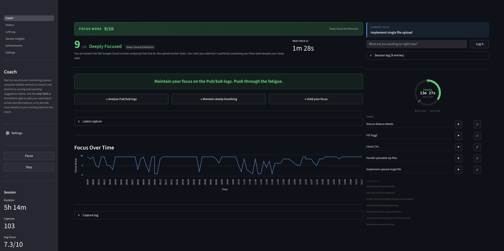
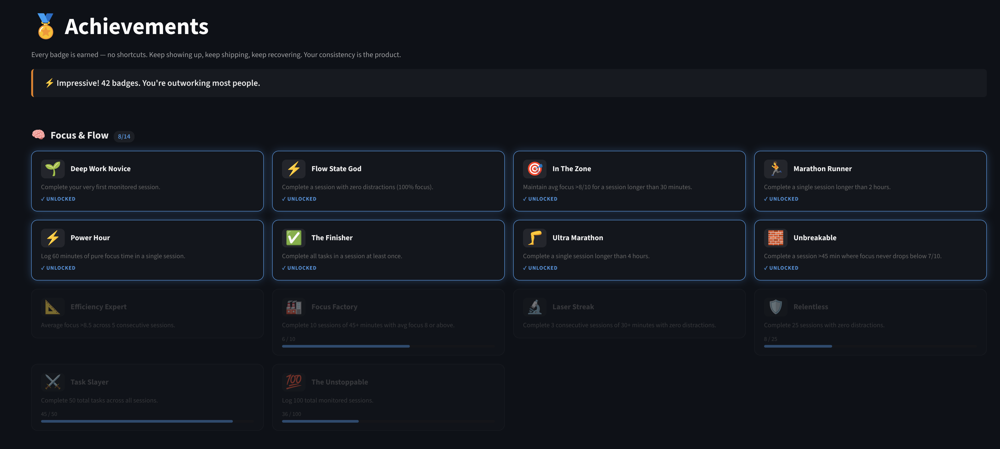
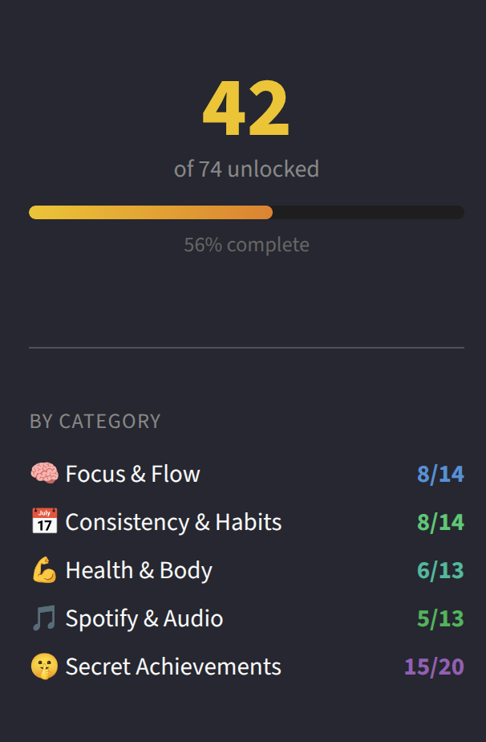

# 🚀 Productivity Coach

[](https://opensource.org/licenses/MIT)
[](https://www.python.org/downloads/)
[](https://streamlit.io)

An AI-powered deep work assistant that watches your focus in real time through your webcam, coaches you with direct instructions, enforces a Pomodoro-style sprint rhythm, and tracks every session so you can see exactly where your time goes.

Built with [Streamlit](https://streamlit.io), [LangGraph](https://github.com/langchain-ai/langgraph), and [Gemini](https://cloud.google.com/vertex-ai/generative-ai/docs/overview) via Google Cloud Vertex AI.


---

## 📑 Table of Contents

- [⚙️ How it works](#️-how-it-works)
- [✨ Features](#-features)
  - [🧠 Core coaching](#-core-coaching)
  - [⏱️ Pomodoro sprint system](#️-pomodoro-sprint-system)
  - [📋 Task list](#-task-list)
  - [🔔 Audio & notifications](#-audio--notifications)
  - [🔋 Break quality](#-break-quality)
  - [📊 Analytics](#-analytics)
  - [🏆 Achievements](#-achievements)
  - [💾 Data & export](#-data--export)
- [🔌 Integrations](#-integrations)
  - [🎵 Spotify](#-spotify)
  - [⌚ Fitbit](#-fitbit)
- [🚀 Quick start](#-quick-start)
- [🛠️ Tech stack](#️-tech-stack)
- [🔒 Privacy](#-privacy)
- [📄 License](#-license)

---

## ⚙️ How it works

Every 1-2 minutes (randomised interval) the app captures a webcam frame and sends it to Gemini along with a rolling history of recent check-ins, your session goal, current sprint time, task list, and optional Spotify/Fitbit context. The model returns a structured coaching assessment — focus score, activity label, distraction category, coaching instruction, and posture feedback — and the UI updates instantly.

The app operates in two modes:

- **FOCUS** — you're working. The AI tells you exactly what to do and for how long.
- **REST** — you've earned a genuine break. The AI tells you how to recover. Distraction alone does *not* trigger REST; the AI will try to pull you back to focus first.

All session data is stored locally in SQLite. Nothing leaves your machine except what is sent to the Vertex AI inference endpoint.

---

## ✨ Features

### 🧠 Core coaching
- Real-time focus score (1-10) with colour-coded coaching card
- Two-mode system (FOCUS / REST) with intelligent mode switching
- Posture correction callout when the webcam can see you
- Activity label and distraction category badges
- Three suggestion cards per check-in alongside the main coaching instruction
- Adaptive check-in intervals — shorter when focus is unstable, longer during deep flow
- Session goal input — passed to the LLM every cycle so coaching stays on-topic
- Pause / Resume without ending the session

### ⏱️ Pomodoro sprint system
- Circular sprint timer in the UI: green (< 25 min), amber (25-40 min), red (> 40 min)
- **Ideal sprint**: 25-30 minutes — the AI is instructed not to call REST before the 20-minute minimum
- **Hard cap**: 40 minutes — the scheduler forces a REST transition regardless of AI output
- **Short break**: 5 minutes; **long break**: 15 minutes after every 4th completed sprint
- Sprint count tracked and shown in the sidebar throughout the session

### 📋 Task list
- Add notes to the session log at any time during a session
- On each note submission, Gemini automatically extracts and deduplicates actionable tasks (max 10 words each) from the full session log
- Tasks appear in a live list beside the sprint timer with **▶ set as current focus** and **✓ mark done** controls
- Completed tasks are never re-created; when the list is empty the AI prompts you to add tasks and rewards task planning with a high focus score

### 🔔 Audio & notifications
- Synthesised audio cues — ascending chime on FOCUS, descending tone on REST (pygame + numpy, no audio files)
- Neural text-to-speech via [Piper](https://github.com/rhasspy/piper) — coaching instructions read aloud on mode changes, persistent low focus (> 3 min), persistent posture issues (> 3 min), and poor break quality (auto-downloads ~100 MB voice model on first use)
- Desktop notifications via browser + `notify-send` for the same events

### 🔋 Break quality
- Algorithmic break quality scoring from keyboard and mouse activity (via `pynput`) — no LLM guessing
- High input activity during REST = poor break score; genuine rest = high score

### 📊 Analytics

**Session Insights** — deep dive into a single session:
- Header metrics: duration, check-in count, average focus score, focused %, mode switches, average break quality
- Mode timeline Gantt chart (FOCUS = green, REST = blue)
- LLM-generated session summary (auto-generated on session stop, or on demand)
- Focus score timeline with mode colouring and a score-7 reference line
- Heart rate overlay with HR zone colouring and resting HR reference line (Fitbit only)
- Mode duration breakdown bar chart
- Break quality bar chart per REST check-in
- Distraction category breakdown
- Input activity area charts (keystrokes, clicks, mouse distance)
- Full session log and capture log table
- Cross-session trend lines (last 30 sessions) with the selected session highlighted

**History** — multi-session view:
- Date range filter
- Streak and milestone metrics with badges (🔥 7-day streak, 🏆 30-day streak, 📅 10 sessions, 💯 50 sessions, 👁 100 check-ins, 🎯 5 deep work days)
- Three trend charts: average focus score, focused %, daily focus minutes
- "When Do You Work Best?" scatter plot (shown after ≥ 3 sessions)
- Per-session expandable list with mini focus timeline and distraction chart
- Weekly AI summary (last 7 days) — headline, observations, recommended actions, patterns

**LLM Log** — request/response inspector:
- Filter by session and call type (analyse, session_summary, weekly_summary, health_check, extract_tasks)
- Summary stats: total calls, input/output tokens, average latency, error count
- Per-call expandable detail: model, tokens, latency, full request and response

### 🏆 Achievements

The app includes a gamified badge system with over 60 unlockable achievements that reward consistency, focus quality, and good work habits.

- **First steps** — complete your first session, hit 100% focus, finish all tasks in a session
- **Streaks** — 3-day, 7-day, 21-day, and 30-day consecutive session streaks
- **Endurance** — sessions over 2 hours, 4 hours, and 100 total hours of tracked time
- **Focus mastery** — sustained high focus, zero distractions across multiple sessions, Iron Discipline chains
- **Work habits** — Early Bird (before 7 AM), Night Owl (after 10 PM), Lunch Warrior, Weekend Zombie, and more
- **Health & biometrics** — Fitbit-powered badges for flow state under low HR, recovery-aware focus, and active breaks
- **Music** — badges for deep work with no music, peak focus with music, DJ behaviour, and loyal listener streaks
- **Humour** — shame badges for vague session goals, 4-hour marathons, and chaotic track-skipping





### 💾 Data & export
- Local SQLite database at `~/.coach/coach.db`
- CSV export from the sidebar
- LLM-generated session summary persisted at the end of each session (headline, overall score, peak period, key observations, tomorrow's actions, correlation insights, unfinished items inferred from the session log)

---

## 🔌 Integrations

### 🎵 Spotify

Connects via OAuth Authorization Code Grant to read the currently playing track, artist, album, and playback state. This context is sent to the LLM each cycle so the coaching can reference your music — e.g. noting that you've been in a long listening streak (likely flow state) or that you switched to a distracting playlist. Token cached at `~/.coach/spotify_token.json`.

### ⌚ Fitbit

Connects via OAuth 2.0 with PKCE to read health data from the Fitbit Web API:

- **Heart rate** — real-time HR polled every cycle, displayed on the Session Insights HR overlay chart with zone colouring
- **Resting heart rate** — reference line on the HR chart
- **Heart rate variability (HRV)** — polled every 5th cycle, included in the LLM health context
- **Steps** — daily step count, polled every 5th cycle
- **Sleep summary** — polled every 5th cycle, included in the LLM health context

Health metrics are included in the LLM system prompt so coaching can account for physiological state (e.g. elevated HR during a break, low HRV suggesting fatigue). Rate limit: 150 requests/hour. Token cached at `~/.coach/fitbit_token.json`.

---

## 🚀 Quick start

```bash
# 1. Clone
git clone https://github.com/your-username/coach.git
cd coach

# 2. Install dependencies
poetry install

# 3. Authenticate with Google Cloud
gcloud auth application-default login
gcloud services enable aiplatform.googleapis.com

# 4. Run
poetry run streamlit run coach/Coach.py
```

Open [http://localhost:8501](http://localhost:8501) in your browser.

For detailed setup instructions including Spotify and Fitbit integration, see the **[Setup Guide](docs/SETUP.md)**.

---

## 🛠️ Tech stack

| Layer | Technology |
|---|---|
| UI | Streamlit |
| AI orchestration | LangGraph |
| LLM | Gemini via `langchain-google-vertexai` (Vertex AI, ADC) |
| Structured output | Pydantic |
| Webcam | OpenCV (`opencv-python-headless`) |
| Image processing | Pillow |
| Input monitoring | `pynput` |
| Audio | pygame + numpy (synthesised waveforms) |
| Text-to-speech | Piper (`piper-tts`) |
| Spotify | `spotipy` (OAuth Authorization Code Grant) |
| Fitbit | `requests` (OAuth 2.0 PKCE) |
| Charts | Altair via Streamlit |
| Persistence | SQLite (stdlib) |
| Dependency management | Poetry |

---

## 🔒 Privacy

Webcam frames are sent to the Google Vertex AI API for analysis each cycle. If Spotify or Fitbit are connected, the currently playing track and health metrics are included in the LLM context. All session data (focus scores, activity labels, coaching instructions, health metrics, task list) is stored locally in SQLite at `~/.coach/coach.db`. Nothing is sent to Google beyond what is needed for the Vertex AI inference call.

---

## 📄 License

MIT
